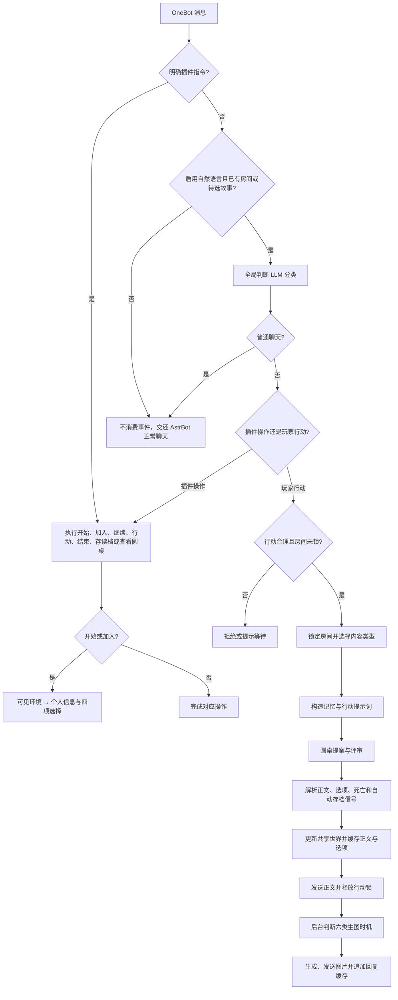

# 架构说明

本文面向维护者，概述消息如何进入插件以及主要状态边界。实现细节以代码和测试为准。

## 消息处理流程

## 模块职责

| 模块 | 职责 |
| --- | --- |
| `main.py` | AstrBot 事件入口、指令与自然语言编排、房间生命周期 |
| `services/config.py` | 面板配置解析与默认值 |
| `services/llm.py` | AstrBot LLM 提供商调用、流式兼容和超时 |
| `services/game.py` | 全局判断、行动锁及游戏级判断结果 |
| `services/roundtable.py` | 提案/评审调度、优先级、轮次和失败回退 |
| `services/prompts.py` | 开局、行动、评审、角色和压缩提示词 |
| `services/storage.py` | 房间、用户索引、缓存和磁盘持久化 |
| `services/saves.py` | 手动槽、自动槽、共享世界回档和玩家移除 |
| `services/memory.py` | 长期与临时记忆压缩 |
| `services/images.py` | OpenAI 兼容绘图、人物缓存和图像结果 |
| `services/workflows.py` | ComfyUI 工作流节点映射、上传与任务轮询 |
| `services/messaging.py` | OneBot 消息、@解析和合并转发 |
| `services/models.py` | 房间、玩家、故事、讨论记录等数据模型 |

## 状态边界

- 房间保存共享故事底稿、世界进度、记忆和参与者。
- 玩家角色属于房间，但玩家索引保证同一时间只进入一个房间。
- 存档槽属于执行存档的玩家，快照内容仍包含共享世界。
- 行动锁属于房间，只阻止并发的游戏行动，不阻止普通聊天和非行动指令。
- 圆桌讨论记录只保留最近一次开局、加入角色或故事行动产生的圆桌调用，独立于长期故事记忆。
- 最近回复缓存属于房间，保存最后一次行动文字与已完成生成的图片路径。
- 生图任务属于插件后台任务，不持有房间行动锁；插件终止时会取消未完成任务。

## 关键不变量

- 玩家只声明行动，剧情结果由圆桌会议决定。
- 全局判断 LLM 不决定剧情结果。
- 普通聊天不得因玩家正处于故事中而被强制消费。
- 未开局的消息不得调用插件全局判断 LLM。
- 多人房间一次只接受首条被判定为有效游戏行动的消息。
- 回档必须同时恢复共享世界，并移除在该快照之后加入的角色。
- 死亡提示始终单独分段发送 `You are dead`；房间保留，等待玩家读档或主动结束故事。
